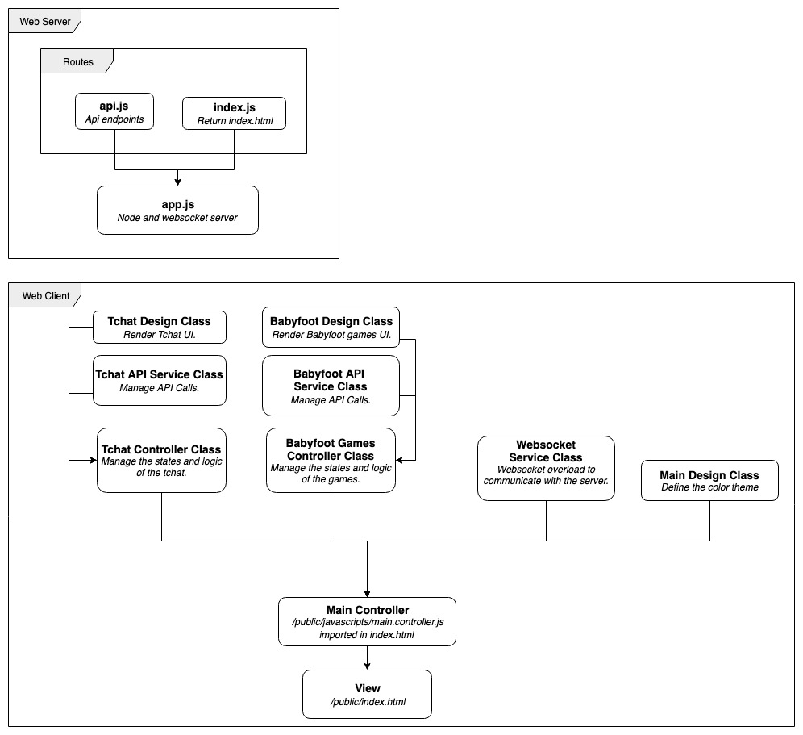

# Babyfoot Manager

## Introduction

A Babyfoot manager is a web application aim to manage your babyfoot games. The application allows users to create games and update the game status (in progress / done) with other users in real-time.
You can tchat with other people and make the babyfoot game crazy !!

## Demo

[Click here to visit the app online.](https://babyfoot.steevep.com)


## Table of Contents

- [Babyfoot Manager](#babyfoot-manager)
  - [Introduction](#introduction)
  - [Demo](#demo)
  - [Table of Contents](#table-of-contents)
  - [Babyfoot API Documentation](#babyfoot-api-documentation)
  - [Setup](#setup)
  - [Quick Start](#quick-start)
    - [Installation through docker-compose](#installation-through-docker-compose)
    - [Installation without docker-compose](#installation-without-docker-compose)
  - [File Structure](#file-structure)
  - [Project Structure](#project-structure)

## Babyfoot API Documentation

To view the API documentation, visit [babyfoot.steevep.com/api/v1/](https://babyfoot.steevep.com/api/v1). You can also access locally to the documentation after running the project at the url [localhost:3010/api/v1](http://localhost:3010/api/v1)

## Setup

In order to run and deploy quickly the application you may install Docker and Docker-compose. Then follow the [setup through docker-compose](#installation-through-docker-compose) section. It easier to manage the project through containers. When you're making a file edit, it's editing the file on the container automatically.

Otherwise, you can setup and run the project locally on your laptop without containers. Follow the [Installation without docker-compose](#installation-without-docker-compose) section.

## Quick Start

### Installation through docker-compose

Make sure you have installed docker-compose and docker before continu, otherwhise [install here](https://docs.docker.com/install/).

You must create a the root directory an env file called ".env" with the following configuration:
```js
PORT=3010
PGHOST='babyfoot.db'
PGPORT=5432
PGUSER='root'
PGPASSWORD='root'
PGDATABASE='babyfoot'
```

to run the project:
```shell
$ docker-compose up -d
```

to run the unit tests, you must keep the containers up:
```shell
$ docker-compose -p bf-test run -p 3000 --rm bf-server npm run test
```

to stop the project:
```shell
$ docker-compose down
```

### Installation without docker-compose

You must have postgresql installed before continu, [check-out](https://www.postgresql.org/download/).

If you haven't created a user, you should run before:
`createuser <username> --createdb`.
First you need to create your database with the following command:
```shell
$ createdb -h localhost -p 5432 -U $USER babyfoot
```
Then create the tables by dumping the database:
```shell
$ psql babyfoot < ./db/init.sql
```
If you want to check your database on postgresql, you can run:
`psql -U $USER -d babyfoot` and display the tables in the psql cli with: `\dt`;

Create a the root directory an env file ".env" with the following configuration:

```js
PORT=3010
PGHOST='localhost'
PGPORT=5432
PGUSER=<$USER> //insert your laptop username
PGPASSWORD=null
PGDATABASE='babyfoot'
```

Then, install the required packages in the root directory:
```shell
$ npm install
```

Launch the project with the following command:
```shell
$ npm start
```

To launch the tests, execute the command:
```shell
$ npm test
```

## File Structure

Within the download you'll find the following directories and files:

```
|-- Babyfoot Manager,
    |-- .dockerignore',
    |-- .gitignore',
    |-- Dockerfile',
    |-- README.md',
    |-- app.js',
    |-- docker-compose.yml',
    |-- package-lock.json',
    |-- package.json',
    |-- api',
    |   |-- index.js',
    |   |-- queries',
    |-- bin',
    |   |-- www',
    |-- db',
    |   |-- init.sql',
    |-- doc',
    |   |-- captured.gif',
    |   |-- structure.jpg',
    |   |-- swagger.yml',
    |-- public',
    |   |-- .DS_Store',
    |   |-- index.html',
    |   |-- favicons',
    |   |   |-- android-icon-144x144.png',
    |   |   |-- android-icon-192x192.png',
    |   |   |-- android-icon-36x36.png',
    |   |   |-- android-icon-48x48.png',
    |   |   |-- android-icon-72x72.png',
    |   |   |-- android-icon-96x96.png',
    |   |   |-- apple-icon-114x114.png',
    |   |   |-- apple-icon-120x120.png',
    |   |   |-- apple-icon-144x144.png',
    |   |   |-- apple-icon-152x152.png',
    |   |   |-- apple-icon-180x180.png',
    |   |   |-- apple-icon-57x57.png',
    |   |   |-- apple-icon-60x60.png',
    |   |   |-- apple-icon-72x72.png',
    |   |   |-- apple-icon-76x76.png',
    |   |   |-- apple-icon-precomposed.png',
    |   |   |-- apple-icon.png',
    |   |   |-- browserconfig.xml',
    |   |   |-- favicon-16x16.png',
    |   |   |-- favicon-32x32.png',
    |   |   |-- favicon-96x96.png',
    |   |   |-- favicon.ico',
    |   |   |-- manifest.json',
    |   |   |-- ms-icon-144x144.png',
    |   |   |-- ms-icon-150x150.png',
    |   |   |-- ms-icon-310x310.png',
    |   |   |-- ms-icon-70x70.png',
    |   |-- images',
    |   |   |-- .DS_Store',
    |   |   |-- delete.png',
    |   |-- javascripts',
    |   |   |-- main.controller.js',
    |   |   |-- main.design.js',
    |   |   |-- babyfoot',
    |   |   |   |-- babyfoot.api.service.js',
    |   |   |   |-- babyfoot.controller.js',
    |   |   |   |-- babyfoot.design.js',
    |   |   |-- services',
    |   |   |   |-- websocket.service.js',
    |   |   |-- tchat',
    |   |       |-- tchat.api.service.js',
    |   |       |-- tchat.controller.js',
    |   |       |-- tchat.design.js',
    |   |-- stylesheets',
    |       |-- babyfoot.css',
    |       |-- global.css',
    |       |-- tchat.css',
    |       |-- themes.css',
    |-- routes',
    |   |-- api.js',
    |   |-- index.js',
    |-- test',
        |-- api.test.js',
```

## Project Structure


